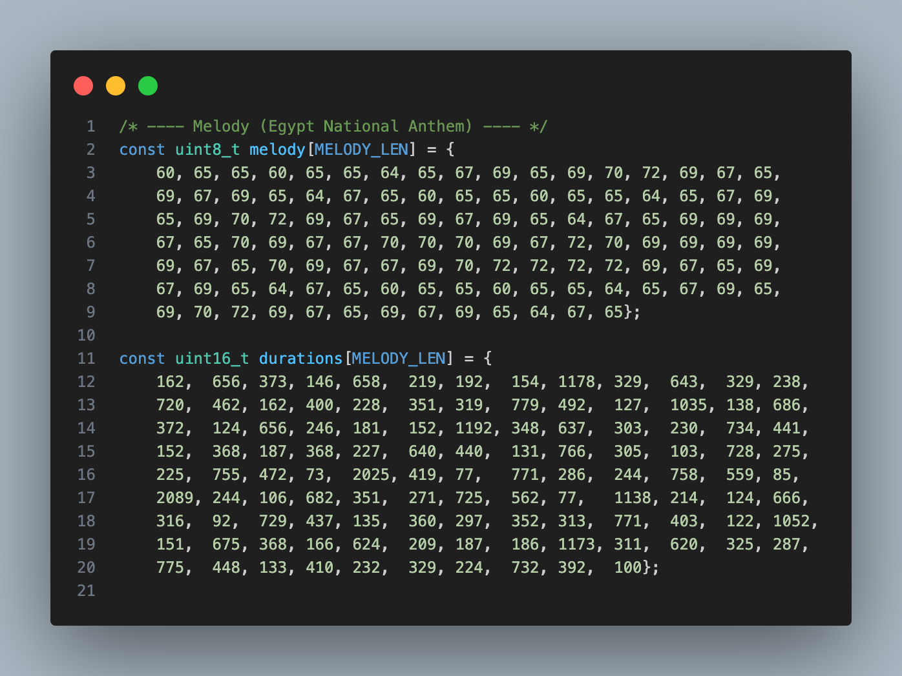

# Egyptian National Anthem – MIDI to PWM on ATmega32A

---

## 📌 Overview
This project demonstrates a **full pipeline from digital audio to embedded sound generation**.

The **Egyptian National Anthem** was converted from an **MP3 audio file** into a **MIDI file**, then processed using **Python scripts** to extract musical notes and durations. These data were transformed into **C arrays** and finally deployed on an **ATmega32A microcontroller**, where the anthem is played using **PWM-based sound generation**.

The project combines **signal processing, scripting, and low-level embedded programming** into a single practical application.

---

## 🎯 Project Goals
- Convert real audio (MP3) into a structured musical representation (MIDI)
- Extract melody and timing information programmatically
- Generate embedded-compatible note arrays
- Play complex melodies on a microcontroller using **PWM**

---

## 🧠 System Flow
1. Convert **MP3 → MIDI** using audio-to-MIDI tools
2. Process MIDI file using **Python script**
3. Extract:
   - Musical notes (frequencies)
   - Note durations (timing)
4. Convert extracted data into **C arrays**
5. Test arrays using a Python playback script
6. Deploy arrays into **ATmega32A firmware**
7. Generate sound using **PWM output**

---

## 🧩 Technologies Used

### 🔹 Software
- Python 3
- MIDI processing libraries
- Audio-to-MIDI conversion tools

### 🔹 Embedded
- ATmega32A
- AVR-GCC
- Timer / PWM peripherals
- Buzzer or speaker

---

## 🐍 Python Processing

### ➤ MP3 to MIDI Conversion
The original anthem audio is converted into a MIDI file containing:
- Note pitch
- Timing information

> This step transforms raw audio into structured musical data.

### ➤ MIDI Parsing Script
A Python script parses the MIDI file and extracts:
- Note frequencies
- Note durations

These values are exported as **C-style arrays** compatible with embedded systems.

### ➤ Array Testing Script
Before deploying to hardware, another Python script is used to:
- Validate note order
- Verify timing correctness
- Simulate melody playback

---

## ⚙️ Embedded Implementation (ATmega32A)

- The generated arrays are included in the firmware
- A hardware **Timer** is configured in **PWM mode**
- PWM frequency is adjusted to match musical notes
- Duty cycle controls sound intensity

The microcontroller sequentially iterates through the arrays to reproduce the anthem melody.

---

## 🔌 Hardware Setup
- ATmega32A Microcontroller
- Speaker or piezo buzzer
- External crystal (optional)
- Power supply (5V)

---

## 📂 Project Structure
```text
README.md

scripts/
 ├── mp3_to_midi.py        # Audio to MIDI conversion
 ├── midi_to_arrays.py     # MIDI parsing & array generation
 └── test_melody.py        # Melody playback testing

firmware/
 ├── main.c                # ATmega32A firmware
 ├── melody.h              # Generated note & duration arrays
 └── timer_pwm.c           # PWM sound driver

media/
 ├── anthem_original.mp3
 ├── anthem.mid
```

---

## 🖼️ Media Showcase

### 🎼 Audio & MIDI Files
> Original audio and generated MIDI file

🔊 **Original Anthem (MP3)**  
[Listen / Download](sound/egypt.mp3)

🎼 **Generated MIDI File**  
[Download MIDI](sound/egypt.mid)

### 🧠 Data Extraction Visualization
> Add screenshots of Python script output or plots here



### 🔊 Hardware Output Demo
> Add videos of the ATmega32A playing the anthem

[Watch the hardware demo](video/IMG_4576.MOV)
---

## 🚀 How to Run

### Python Side
1. Convert MP3 to MIDI
2. Run MIDI parsing script
3. Generate melody & duration arrays
4. Test arrays using Python

### Embedded Side
1. Include generated arrays in firmware
2. Configure PWM timer
3. Flash code to ATmega32A
4. Connect speaker
5. Play the anthem 🎶

---

## 🛠️ Future Improvements
- Polyphonic playback (multiple notes)
- DAC-based audio output
- Volume envelope control
- Support for other songs

---

## 📜 License
This project is open-source and intended for **educational and experimental purposes**.

---

## 👤 Author
**Mohammed Gharib Mohammed El-Ahmady**  
Embedded Systems Engineer